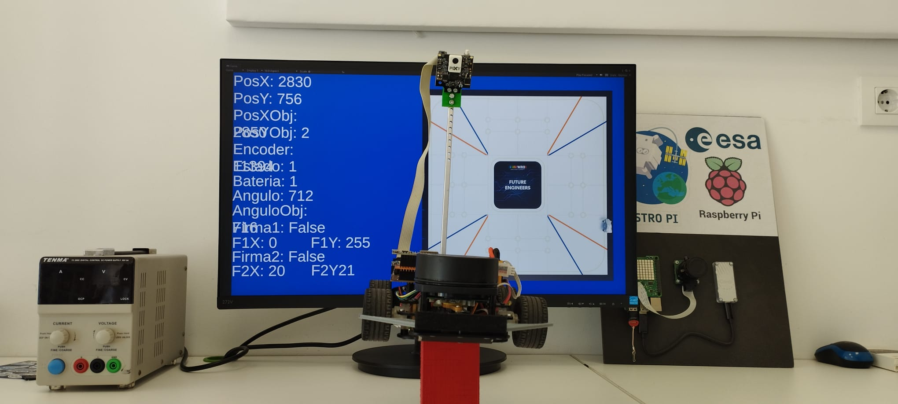
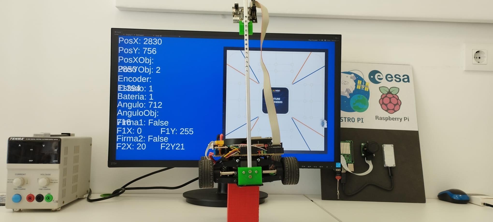
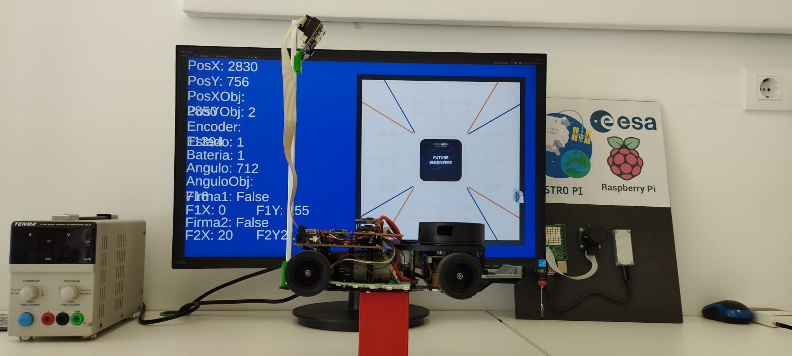
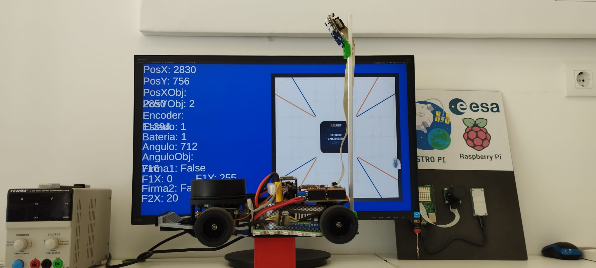
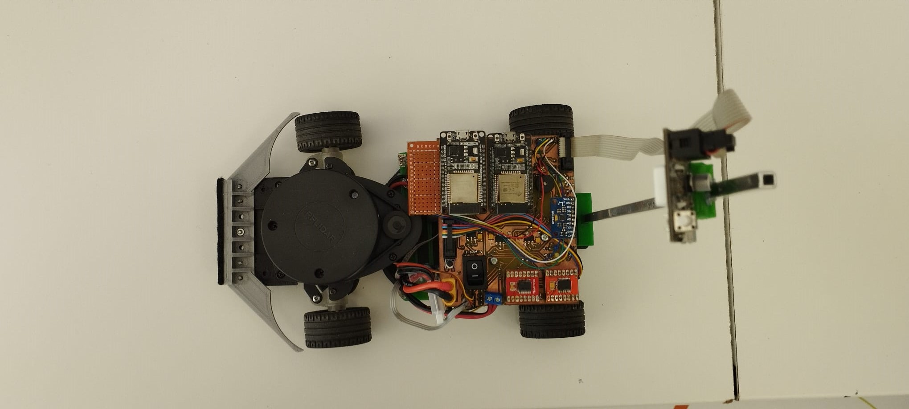
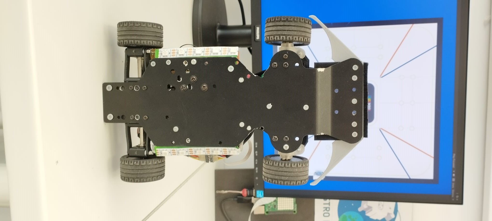
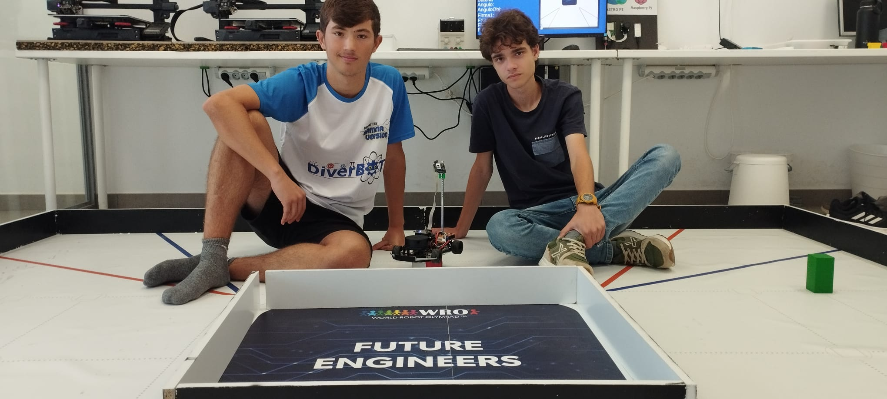
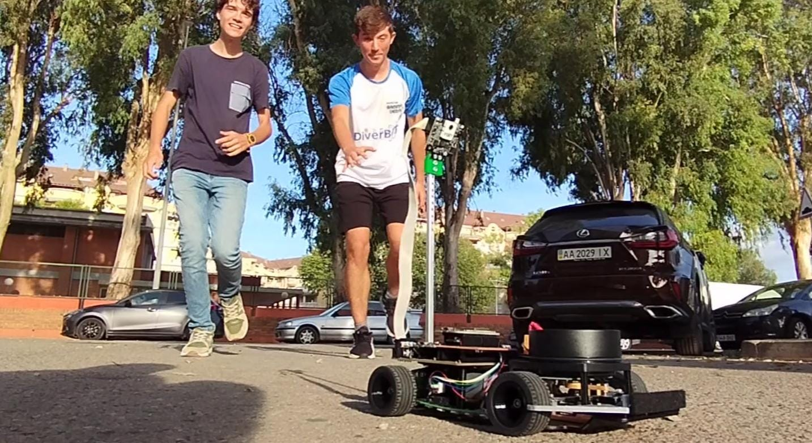

# WRO 2023 GammaVersion's
**GammaVersion's repo for WRO Future Engineers 2023 season**

***

## Contents

* [Hardware](#hardware)
    * [Components](#component-list)
    * [Models](#models)
    * [Electronics](#electronics)
    * [Ackerman's](#ackerman-steering-geometry)

* [Software](#software)
    * [Sensors](#sensors)
    * [Position](#position)
    * [Strategy](#strategy)

* [Photos](#photos)
    * [Car images](#car-images)
    * [Team images](#team-images)

* [Videos](#videos)
    * [Demonstration videos](#demonstration-videos)

* [Legal](#legal)
    * [License](#license)
    * [Credits](#credits)

***

## Hardware
Building an autonomous car for this challenge involves a meticulous process of reimagining and redesigning various components to achieve precision, safety, and efficiency. In this project, we focused on enhancing the car's steering mechanism, designing a custom-printed circuit board (PCB) to connect all the components seamlessly, and implementing Light Detection and Ranging (LiDAR) technology for superior distance measurement compared to traditional ultrasonic sensors.

### Component List
* **DOIT ESP32 DevKit V1 x2**
* **Pixy 2**
* **RPLIDAR A1 M8**
* **MPU 9250**
* **Pololu Magnetic Encoder**
* **DSM44 Servo**
* **RC Smart Car Chassis Kit** Includes a simple motor
* **Motor Driver x2**
* **Power Supply x3**
* **RGB LEDS**

### Models
**3D-Printed Supports and Structural Parts:**
As a crucial part of our project, we designed and 3D-printed custom supports to secure mechanical components and sensors. These supports ensured precise placement and minimized interference. Additionally, we utilized 3D printing to create lightweight yet robust structural components, allowing us to tailor the car's design to our specific needs while maintaining its strength and adaptability.

### Electronics
**LiDAR Implementation:**
Rather than relying on traditional ultrasonic sensors for obstacle detection, we opted for LiDAR technology. LiDAR, which stands for Light Detection and Ranging, uses laser beams to measure distances to objects with exceptional precision. This technology offers several advantages over ultrasonic sensors:

a. Greater Range: LiDAR can detect objects at much greater distances, providing the car with more time to react to potential obstacles.

b. High Precision: LiDAR provides accurate distance measurements, resulting in better navigation and collision avoidance.

c. 360-Degree Coverage: LiDAR offers a full 360-degree view around the car, ensuring comprehensive situational awareness.

d. Environmental Adaptability: LiDAR is less affected by environmental factors such as ambient light, making it more reliable in various conditions.

**Esp-32**
To bring our autonomous car project to fruition, we opted for the ESP-32 microcontroller as the central control unit. The ESP-32 boasts several compelling advantages that played a pivotal role in our decision-making process:

1. Computing Power and Versatility: The ESP-32 distinguishes itself with its robust computational capabilities and remarkable versatility. Equipped with a potent dual-core processor and ample memory capacity, it emerged as the natural choice for our robotics endeavor, enabling rapid computation and accommodating our storage needs seamlessly.

2. Advanced Wireless Connectivity: The ESP-32 integrates cutting-edge Wi-Fi and Bluetooth connectivity, positioning it as a frontrunner for efficient wireless communication. This capability empowered us to establish seamless and reliable communication channels between the autonomous car and external devices, such as remote controls or monitoring systems.

3. Sensor and Actuator Compatibility: The ESP-32's adaptability extends to sensor and actuator integration. With its multitude of I/O (input/output) pins and versatile interface options, we effortlessly connected and controlled various sensors, including the IMU and LiDAR, as well as the steering servos.

**Custom PCB Design:**
To seamlessly connect and control all the components of our autonomous car, we designed and printed a custom PCB. The PCB acted as the central hub that allowed us to interface with sensors, motors, microcontrollers, and other electronic components efficiently.

Our custom PCB design allowed for cleaner wiring, reduced interference, and enhanced reliability. It simplified the process of connecting and configuring various sensors and actuators, enabling smoother integration and troubleshooting during the development phase.

Our custom-designed PCB played a central role in integrating various components seamlessly. To ensure efficient power management and distribution, we implemented three distinct power sources:

a. Dual 5-Volt Power Supplies: One 5-volt power supply was dedicated to powering the LiDAR system, while the other supplied power to the steering servos. This separation of power sources allowed us to optimize the energy delivery to these critical components, ensuring their reliable operation.

    

    

b. 3.3-Volt Power Supply: A dedicated 3.3-volt power supply was employed to energize the microcontrollers, IMU (Inertial Measurement Unit), motor drivers, and LED lights. This voltage level was carefully chosen to meet the requirements of these electronic components, guaranteeing stable and consistent performance.

By employing these distinct power sources, we effectively managed the power needs of our autonomous car's various subsystems, ensuring that each component received the appropriate voltage and current for reliable operation. This meticulous power management contributed to the overall success and stability of our robotics project.

### Ackerman's Steering Geometry
One of the key aspects of our project was reimagining the steering system to achieve a reduced turn ratio. To accomplish this, we implemented Ackermann steering geometry. Ackermann steering geometry is a mechanism that ensures that all four wheels of the car track along different paths during a turn, reducing tire wear and enabling smoother and more precise turns.

By incorporating Ackermann steering, we were able to optimize the car's turning radius, allowing it to navigate tighter corners with ease. This was achieved by adjusting the angles of the wheels and their pivot points, ensuring that the inner and outer wheels followed distinct paths, greatly enhancing the car's maneuverability.

***

## Software

### Sensors
* **MPU:** We use the MPU's GyroScope functionality to measure the angular speed along the Z-axis. Integrating this speed over time we get the orientation of the car.
* **Encoder:** The encoder allows us to know the displacement of the car and consequently its speed, which we regulate using a PID controller.
* **LIDAR:** The LIDAR sensor measures distances on a 360º range, therefore it allows the car to have a great knowledge of the surroundings. We store all the readings in an array when they are received.
* **Pixy 2:** Pixy is an intelligent camera which can identify regions with the same colour. As a result, our code to handle the detection of the traffic lights is very reduced. 

### Position
With the data of the orientation and the displacement of the car we are able to calculate the position of the car. This is worked out by integrating the displacement over the trajectory of the car. With these calculations the coordiante origin is set to the initial position of the car, but we change it to the bottom left corner of the playfield with the measures of the LIDAR.

### Strategy
Our strategy is to make the car able to define a path for the it to follow depending on the colour blocks it detects. We devide the playfield into eight sections, and the car stores whether it has to travel to the right or to the left in each section.

***

## Photos

### Car images
| | |
| ------------------------- | ------------------------- |
|  |  |
|  |  |
|  |  |

### Team images
| | |
| ------------------------- | ------------------------- |
|  |  |

***

## Videos

### Demonstration videos

Demonstration videos of the car successfully completing both challenges.
The links to each of them can be found in:
* [Open Challenge](https://youtu.be/Oyp9x_MhnpQ?si=n7GRa3e0AN-YdxIk)
* [Obstacle Challenge](https://youtu.be/bCaAXYcNQ1c)

***

## Legal

### License

The [source code](/code/) in this repository is licensed under the **GNU General Public License v3.0**.

The [hardware](/robot-info/hardware/) exposed in this project is licensed under the **Creative Commons Attribution Share Alike 4.0 International** license.

The documentation of this repository; found in [`robot-info`](/robot-info/), [`vehicle-photos`](/vehicle-photos/), [`videos`](/videos/), [`team-photos`](/team-photos/), as well as this `README.md`; is licensed under the **CERN Open Hardware Licence Version 2 - Strongly Reciprocal** license.

A copy of each license can be found in the [LICENSE](LICENSE) file. More information about the licenses in the specific README.md of each section.

### Credits

***
